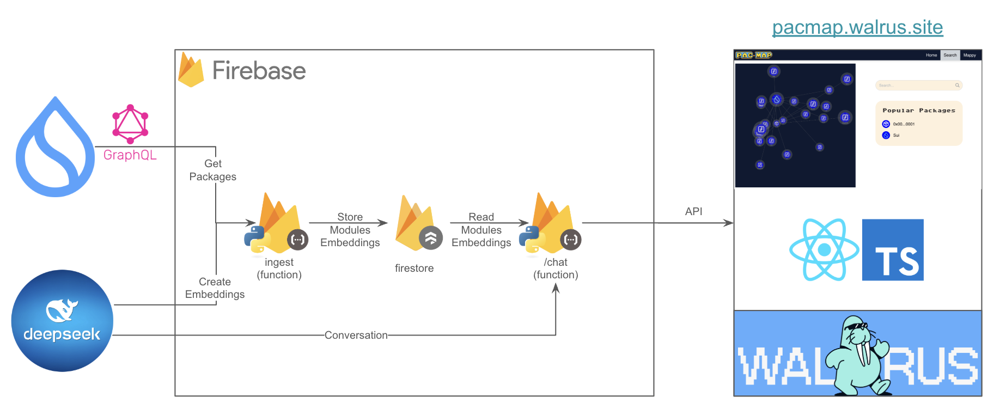

# Welcome to [PacMap](https://pacmap.walrus.site/)

## Accelerate Development on Sui

Explore our powerful platform designed for Sui programmers, where you can easily map and manage code packages for better and faster dapp development.

This codebase serves: https://pacmap.walrus.site/

## Architecture



# Prerequisites

1. Nvm installed on the machine, or Node version v20.18.0 (inside the .nvmrc file)
2. Python 3.12.3

## 🛠 Local setup

1. Clone this repository:

   ```bash
   git clone https://github.com/ppsimatikas/pacmap
   ```

   ```bash
   cd pacmap
   ```

2. **Backend**: Install the required python dependencies:

   ```bash
   cd functions
   ```
   ```bash
   python -m venv venv && source venv/bin/activate
   ```
   ```bash
   pip install -r requirements.txt
   ```
   ```bash
   cp .env.example .env 
   ```
   Get a Deepseek API key from here: https://platform.deepseek.com/api_keys


3. **Frontend**: Install the required node dependencies:

   ```bash
   nvm use
   ```
   ```bash
   npm install -g yarn
   ```
   ```bash
   yarn
   ```

## 🚀 Run Locally

Start both frontend and backend (firebase emulators):

```bash
yarn start
```

Visit Emulator UI: http://127.0.0.1:4000/

Visit ui: http://localhost:5173/


## 💻 Deployment

As shown in the architecture diagram, the frontend is deployed on Walrus Sites and the backend on firebase.

**You must follow the instructions to setup walrus locally [here](https://docs.walrus.site/walrus-sites/tutorial-install.html).**

Simply deploy both FE and BE:
```bash
yarn deploy
```

For UI:
```bash
yarn deploy:ui
```

For Backend:
```bash
yarn deploy:functions
```

